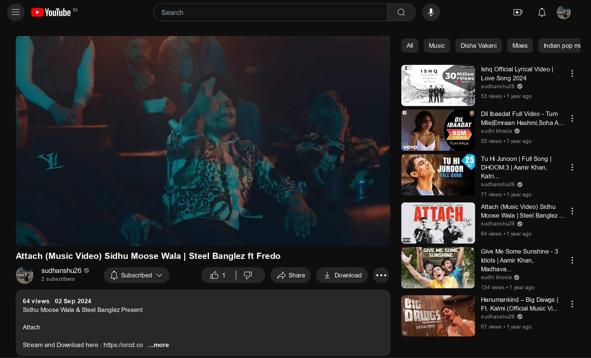

# YouTube Clone (MERN)  

A full-stack YouTube Clone project with a **properly structured backend** built using Node.js, Express, and MongoDB.  
The backend includes authentication, video workflows, playlists, comments, likes, subscriptions, dashboard APIs, and AI-powered helpers.

## Homepage Preview

> Add your deployed homepage screenshot here.



## Backend Status

✅ The backend is fully created with modular architecture and API routes for:
- User authentication and profile management
- Video upload and video interactions
- Playlists, likes, comments, and subscriptions
- Dashboard and healthcheck endpoints
- AI route integration

## Tech Stack

- **Frontend:** React, Redux Toolkit
- **Backend:** Node.js, Express.js, MongoDB, Mongoose
- **Auth & Security:** JWT, bcrypt, cookie-parser, CORS
- **Media & Utilities:** Cloudinary, Multer, Morgan

## API Base Route

`/api/v1`

## Quick Start

### 1) Clone and install dependencies
```bash
cd client && npm install
cd ../server && npm install
```

### 2) Configure server environment (`/server/.env`)
```env
PORT=5000
MONGODB_URL=your_mongodb_connection_string
CORS_ORIGIN=http://localhost:3000

ACCESS_TOKEN_SECRET=your_access_secret
ACCESS_TOKEN_EXPIRY=1d
REFRESH_TOKEN_SECRET=your_refresh_secret
REFRESH_TOKEN_EXPIRY=10d

CLOUDINARY_CLOUD_NAME=your_cloud_name
CLOUDINARY_API_KEY=your_api_key
CLOUDINARY_API_SECRET=your_api_secret

GOOGLE_AI_KEY=your_google_ai_key
```

### 3) Run the apps
```bash
# Terminal 1
cd server && npm run dev

# Terminal 2
cd client && npm start
```

## Project Structure

```text
Youtube-Clone/
├── client/
└── server/
    └── src/
        ├── controllers/
        ├── models/
        ├── routes/
        ├── middlewares/
        └── utils/
```

## Author

**Sudhanshu**
